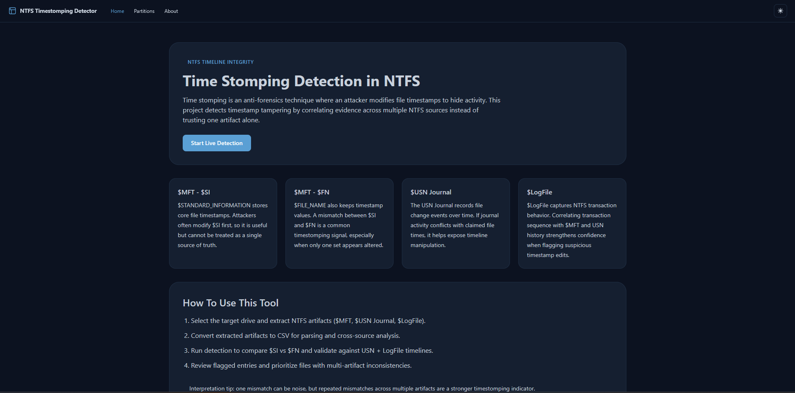
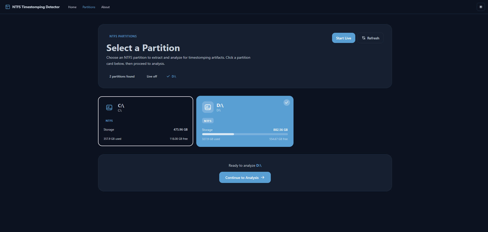
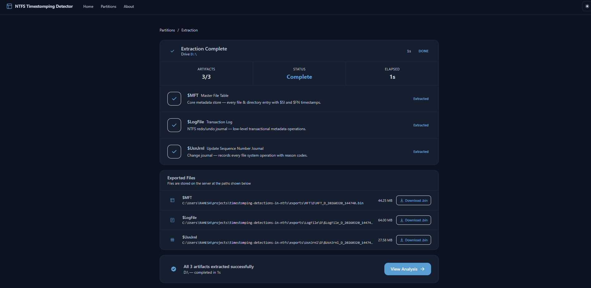

# Timestomping Detection in NTFS

An end-to-end digital forensics project for detecting timestamp tampering (timestomping) on NTFS volumes by correlating metadata from $MFT, $UsnJrnl, and $LogFile.

## Project Status

Completed on March 20, 2026.

This repository now includes:

- A React + Vite frontend for investigator workflow
- A FastAPI backend for extraction and analysis APIs
- NTFS artifact extraction and CSV conversion pipeline
- Export management for generated forensic data
- Final UI screenshots documented below

## Core Detection Idea

Timestomping often modifies timestamps in $STANDARD_INFORMATION ($SI) but cannot cleanly align every related NTFS artifact.

This project cross-checks:

| Artifact | Why it matters |
|---|---|
| $MFT ($SI) | Common target for user-mode timestamp modification |
| $MFT ($FN) | Kernel-maintained timestamps that are harder to falsify consistently |
| $UsnJrnl | File change journal containing operation history |
| $LogFile | Low-level NTFS transaction records |

Any mismatch pattern across these sources increases confidence of tampering.

## Features

- Detect available NTFS partitions
- Extract $MFT, $LogFile, and $UsnJrnl from selected drive
- Convert extracted artifacts into analysis-ready CSV output
- Perform timestamp correlation and anomaly scoring
- Classify suspicious entries by severity
- List and download exported files from backend endpoints

## High-Level Architecture

1. Frontend requests partition list from backend
2. Investigator selects a target volume
3. Backend runs extraction pipeline for NTFS artifacts
4. Backend converts raw artifacts to CSV and computes detection fields
5. Frontend displays final findings and export links

## Project Structure

```
.
├── app/                        # React + Vite frontend
│   └── src/routes/
│       ├── home.jsx            # Landing page
│       ├── partitions.jsx      # NTFS partition selector
│       ├── analyze.jsx         # Extraction and analysis trigger
│       ├── results.jsx         # Findings and severity view
│       └── viewcsv.jsx         # CSV viewing route
├── backend/                    # FastAPI backend
│   ├── main.py                 # App startup, CORS, mounts
│   └── routes/
│       ├── drives.py           # Drive detection
│       ├── extract_ntfs.py     # Extraction routes
│       ├── analyze.py          # Analysis routes
│       ├── mft_to_csv.py       # MFT conversion route
│       └── analysis/
│           ├── convert/        # LogFile/MFT/UsnJrnl converters
│           └── files/          # Export listing utilities
├── exports/                    # Generated forensic outputs
├── low-level-c/                # Native helper for low-level extraction
├── docs/screenshots/           # README screenshots
├── requirements.txt
└── run_server_admin.bat
```

## Prerequisites

- Python 3.10+
- Node.js 18+
- Windows (administrator privileges required for raw NTFS access)
- Visual Studio Build Tools for C++ (if using native helper build path)

## Setup

### 1) Install backend dependencies

```bash
cd backend
pip install -r ../requirements.txt
```

### 2) Install frontend dependencies

```bash
cd app
npm install
```

### 3) Optional: build low-level C helper

```bash
gcc low-level-c/extract_mft.c -o low-level-c/extract_mft.exe -ladvapi32
```

## Run

### Backend (run as Administrator)

Recommended:

```bash
run_server_admin.bat
```

Manual:

```bash
cd backend
python -m uvicorn main:app --host 127.0.0.1 --port 5000 --reload
```

### Frontend

```bash
cd app
npm run dev
```

Frontend: http://localhost:5173  
Backend API: http://127.0.0.1:5000

## Investigator Workflow

1. Open the frontend dashboard
2. Choose a detected NTFS partition
3. Trigger extraction for all required artifacts
4. Review converted CSV outputs and anomaly results
5. Export data for reporting and further forensic validation

## API Summary

| Method | Endpoint | Description |
|---|---|---|
| GET | /drives | List available NTFS partitions |
| POST | /extract/extract-mft | Extract $MFT |
| POST | /extract/extract-logfile | Extract $LogFile |
| POST | /extract/extract-usnjrnl | Extract $UsnJrnl |
| POST | /extract/extract-all | Extract all three artifacts |
| POST | /analysis/mft/convert | Convert MFT output to CSV |
| GET | /analysis/exports | List generated export files |
| GET | /health | Health check |

## Screenshots

### 1) Application screen



### 2) Application screen



### 3) Application screen



## Tech Stack

- Frontend: React, React Router, Tailwind CSS, Vite
- Backend: FastAPI, Uvicorn, Python utilities for NTFS parsing
- Data Processing: CSV conversion and cross-artifact timestamp correlation

## Notes

- Forensic extraction requires elevated privileges on Windows.
- Use controlled test data before analyzing production systems.
- Review TROUBLESHOOTING.md and API_CHECK.md for diagnostic guidance.